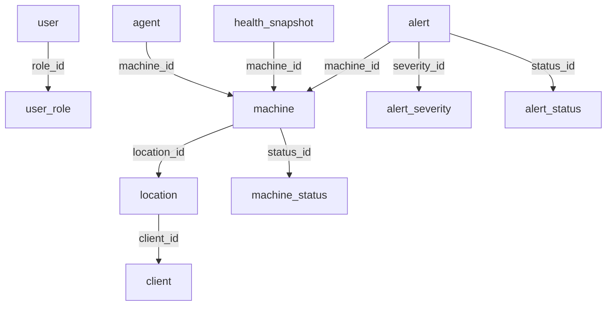

# Database Schema

## Table of Contents

- [Purpose](#purpose)
- [Naming Conventions](#naming-conventions)
- [Common Field Types](#common-field-types)
- [Main Entities](#main-entities)
  - [`user`](#user)
    - [Columns](#columns)
    - [Relationships](#relationships)
  - [`user_role`](#user_role)
    - [Columns](#columns-1)
  - [`client`](#client)
    - [Columns](#columns-2)
  - [`location`](#location)
    - [Columns](#columns-3)
    - [Relationships](#relationships-1)
  - [`machine`](#machine)
    - [Columns](#columns-4)
    - [Relationships](#relationships-2)
  - [`machine_status`](#machine_status)
    - [Columns](#columns-5)
  - [`agent`](#agent)
    - [Columns](#columns-6)
    - [Relationships](#relationships-3)
  - [`health_snapshot`](#health_snapshot)
    - [Columns](#columns-7)
    - [Relationships](#relationships-4)
  - [`alert`](#alert)
    - [Columns](#columns-8)
    - [Relationships](#relationships-5)
  - [`alert_severity`](#alert_severity)
    - [Columns](#columns-9)
  - [`alert_status`](#alert_status)
    - [Columns](#columns-10)
- [Foreign Keys](#foreign-keys)
- [Entity Relationships](#entity-relationships)

## Purpose

This document describes the initial database schema used by the application.

The schema is expected to evolve as the project improves.

## Naming Conventions

* Table names use `snake_case`.
* Column names use `snake_case`.
* Primary keys use `id`.
* Foreign keys use the format `<table_name>_id`.
* Timestamp fields use `created_at`, `updated_at`, or a domain-specific timestamp such as `last_seen` or `resolved_at`.
* Lookup tables are used for values that may need to be extended or managed without changing application code and to avoid hard code.

## Common Field Types

| Type           | Description                                                |
| -------------- | ---------------------------------------------------------- |
| `uuid`         | Unique identifier. Used for primary keys and foreign keys. |
| `varchar(n)`   | Short text with a maximum length.                          |
| `text`         | Longer free-form text.                                     |
| `boolean`      | True or false value.                                       |
| `integer`      | Whole number.                                              |
| `double`       | Number with decimal points.                                |
| `decimal(5,2)` | Numeric percentage or measured value.                      |
| `timestamp`    | Date and time value.                                       |
| `jsonb`        | Structured metadata or flexible payload data.              |

---

# Main Entities

## `user`

Represents a dashboard user who can access the application.

### Columns

| Column       |           Type | Constraints                  | Description                                          |
| ------------ | -------------: | ---------------------------- | ---------------------------------------------------- |
| `id`         |         `uuid` | Primary Key                  | Unique identifier for the user.                      |
| `email`      | `varchar(255)` | Not Null, Unique             | User email address used for login and notifications. |
| `name`       | `varchar(150)` | Not Null                     | User display name.                                   |
| `role_id`    |         `uuid` | Foreign Key → `user_role.id` | Role assigned to the user.                           |
| `is_active`  |      `boolean` | Not Null, Default `true`     | Indicates whether the user account is active.        |
| `created_at` |    `timestamp` | Not Null, Default `now()`    | Date and time when the user was created.             |
| `updated_at` |    `timestamp` | Nullable                     | Date and time when the user was last updated.        |

### Relationships

| Relationship                    | Type        | Description                         |
| ------------------------------- | ----------- | ----------------------------------- |
| `user.role_id` → `user_role.id` | Many-to-one | Many users can share the same role. |

---

## `user_role`

Represents a user role in the dashboard.

Using a dedicated role table allows roles to be added, renamed, or extended without changing the application code.

### Columns

| Column        |           Type | Constraints               | Description                                                              |
| ------------- | -------------: | ------------------------- | ------------------------------------------------------------------------ |
| `id`          |         `uuid` | Primary Key               | Unique identifier for the role.                                          |
| `code`        |  `varchar(50)` | Not Null, Unique          | Stable machine-readable role value, for example `admin` or `technician`. |
| `name`        | `varchar(100)` | Not Null                  | Human-readable role name, for example `Administrator`.                   |
| `description` |         `text` | Nullable                  | Optional description of what the role allows.                            |
| `is_active`   |      `boolean` | Not Null, Default `true`  | Indicates whether the role can currently be assigned.                    |
| `created_at`  |    `timestamp` | Not Null, Default `now()` | Date and time when the role was created.                                 |
| `updated_at`  |    `timestamp` | Nullable                  | Date and time when the role was last updated.                            |

---

## `client`

Represents a customer or company being monitored.

A client may have one or more locations and one or more monitored machines.

### Columns

| Column          |           Type | Constraints               | Description                                       |
| --------------- | -------------: | ------------------------- | ------------------------------------------------- |
| `id`            |         `uuid` | Primary Key               | Unique identifier for the client.                 |
| `name`          | `varchar(200)` | Not Null                  | Client or company name.                           |
| `nif`           |  `varchar(20)` | Nullable, Unique          | Tax identification number.                        |
| `contact_name`  | `varchar(150)` | Nullable                  | Main contact person.                              |
| `contact_email` | `varchar(255)` | Nullable                  | Main contact email address.                       |
| `contact_phone` |  `varchar(50)` | Nullable                  | Main contact phone number.                        |
| `notes`         |         `text` | Nullable                  | Internal notes about the client.                  |
| `is_active`     |      `boolean` | Not Null, Default `true`  | Indicates whether the client is currently active. |
| `created_at`    |    `timestamp` | Not Null, Default `now()` | Date and time when the client was created.        |
| `updated_at`    |    `timestamp` | Nullable                  | Date and time when the client was last updated.   |

---

## `location`

Represents a physical location belonging to a client.

A location can contain one or more monitored machines.

### Columns

| Column           |           Type | Constraints                         | Description                                             |
| ---------------- | -------------: | ----------------------------------- | ------------------------------------------------------- |
| `id`             |         `uuid` | Primary Key                         | Unique identifier for the location.                     |
| `client_id`      |         `uuid` | Not Null, Foreign Key → `client.id` | Client that owns this location.                         |
| `name`           | `varchar(200)` | Not Null                            | Location name, for example `Main Store` or `Warehouse`. |
| `street_address` | `varchar(255)` | Nullable                            | Street address.                                         |
| `postal_code`    |  `varchar(20)` | Nullable                            | Postal code.                                            |
| `city`           | `varchar(100)` | Nullable                            | City.                                                   |
| `municipality`   | `varchar(100)` | Nullable                            | Municipality or administrative area.                    |
| `notes`          |         `text` | Nullable                            | Internal notes about the location.                      |
| `created_at`     |    `timestamp` | Not Null, Default `now()`           | Date and time when the location was created.            |
| `updated_at`     |    `timestamp` | Nullable                            | Date and time when the location was last updated.       |

### Relationships

| Relationship                       | Type        | Description                       |
| ---------------------------------- | ----------- | --------------------------------- |
| `location.client_id` → `client.id` | Many-to-one | A client can have many locations. |

---

## `machine`

Represents a monitored computer, server, POS terminal, or other device.

Each machine belongs to one location. The client can be derived through the location.

### Columns

| Column        |           Type | Constraints                                 | Description                                                                    |
| ------------- | -------------: | ------------------------------------------- | ------------------------------------------------------------------------------ |
| `id`          |         `uuid` | Primary Key                                 | Unique identifier for the machine.                                                                       |
| `location_id` |         `uuid` | Not Null, Foreign Key → `location.id`       | Location where the machine is installed.                                                                     |
| `hostname`    | `varchar(150)` | Not Null                                    | Hostname or device name.                                                                          |
| `os_name`     | `varchar(150)` | Nullable                                    | Operating system name.                                                                          |
| `local_ip`    |  `varchar(45)` | Nullable                                    | Local IP address.address.                                                                       |
| `public_ip`   |  `varchar(45)` | Nullable                                    | Public IP. address.                                                                       |
| `role`        | `varchar(100)` | Nullable                                    | Functional role of the machine, for example `server`, `pos`, or `workstation`.                                                                 |
| `status_id`   |         `uuid` | Not Null, Foreign Key → `machine_status.id` | Current machine status                                                                         |
| `last_seen`   |    `timestamp` | Nullable                                    | Last time the machine was seen by the system.                                                                        |
| `notes`       |         `text` | Nullable                                    | Internal notes about the machine.                                                                       |
| `created_at`  |    `timestamp` | Not Null, Default `now()`                   | Date and time when the machine was created.                                                                       |
| `updated_at`  |    `timestamp` | Nullable                                    | Date and time when the machine was last updated.                                                                       |

### Relationships

| Relationship                             | Type        | Description                              |
| ---------------------------------------- | ----------- | ---------------------------------------- |
| `machine.location_id` → `location.id`    | Many-to-one | A location can have many machines.       |
| `machine.role_id` → `machine_status.id`  | Many-to-one | Many machines can be at the same status. |

> Note: If fast client-level filtering is required, `client_id` may be added to `machine` as a denormalized field. If added, it must remain consistent with `machine.location_id`.

---

## `machine_status`

Represents a status that a machine might be at.

Using a dedicated status table allows statuses to be added, renamed, or extended without changing the application code.

### Columns

| Column        |           Type | Constraints               | Description                                                                |
| ------------- | -------------: | ------------------------- | -------------------------------------------------------------------------- |
| `id`          |         `uuid` | Primary Key               | Unique identifier for the status.                                          |
| `code`        |  `varchar(50)` | Not Null, Unique          | Stable machine-readable status value, for example `active` or `unknown`.   |
| `name`        | `varchar(100)` | Not Null                  | Human-readable status name, for example `Active`.                          |
| `description` |         `text` | Nullable                  | Optional description of what the status allows.                            |
| `is_active`   |      `boolean` | Not Null, Default `true`  | Indicates whether the status can currently be assigned.                    |
| `created_at`  |    `timestamp` | Not Null, Default `now()` | Date and time when the status was created.                                 |
| `updated_at`  |    `timestamp` | Nullable                  | Date and time when the status was last updated.                            |

---

## `agent`

Represents the installed monitoring agent on a machine.

Each agent is linked to one machine.

### Columns

| Column           |           Type | Constraints                          | Description                                            |
| ---------------- | -------------: | ------------------------------------ | ------------------------------------------------------ |
| `id`             |         `uuid` | Primary Key                          | Unique identifier for the agent.                       |
| `machine_id`     |         `uuid` | Not Null, Foreign Key → `machine.id` | Machine where the agent is installed.                  |
| `version`        |  `varchar(50)` | Nullable                             | Installed agent version.                               |
| `token_hash`     | `varchar(255)` | Not Null                             | Secure hash of the agent authentication token.         |
| `is_enabled`     |      `boolean` | Not Null, Default `true`             | Indicates whether the server will listen to the agent. |
| `installed_at`   |    `timestamp` | Nullable                             | Date and time when the agent was installed.            |
| `last_heartbeat` |    `timestamp` | Nullable                             | Last time the agent contacted the backend.             |
| `created_at`     |    `timestamp` | Not Null, Default `now()`            | Date and time when the agent record was created.       |
| `updated_at`     |    `timestamp` | Nullable                             | Date and time when the agent record was last updated.  |

### Relationships

| Relationship                      | Type        | Description                                             |
| --------------------------------- | ----------- | ------------------------------------------------------- |
| `agent.machine_id` → `machine.id` | Many-to-one | A machine can have one or more agent records over time. |

---

## `health_snapshot`

Represents a set of health metrics reported by an agent or machine at a specific point in time.

### Columns

| Column           |           Type | Constraints                          | Description                                   |
| ---------------- | -------------: | ------------------------------------ | --------------------------------------------- |
| `id`             |         `uuid` | Primary Key                          | Unique identifier for the health snapshot.    |
| `machine_id`     |         `uuid` | Not Null, Foreign Key → `machine.id` | Machine that reported the metrics.            |
| `cpu_percent`    | `decimal(5,2)` | Nullable                             | CPU usage percentage.                         |
| `memory_percent` | `decimal(5,2)` | Nullable                             | Memory usage percentage.                      |
| `disk_percent`   | `decimal(5,2)` | Nullable                             | Disk usage percentage.                        |
| `cpu_temp`       | `decimal(5,2)` | Nullable                             | CPU temperature, usually in Celsius.          |
| `uptime_seconds` |      `integer` | Nullable                             | Machine uptime in seconds.                    |
| `created_at`     |    `timestamp` | Not Null, Default `now()`            | Date and time when the snapshot was recorded. |

### Relationships

| Relationship                                | Type        | Description                               |
| ------------------------------------------- | ----------- | ----------------------------------------- |
| `health_snapshot.machine_id` → `machine.id` | Many-to-one | A machine can have many health snapshots. |

---

## `alert`

Represents a problem detected by the system.

Alerts may be created from health snapshots, automations, agent heartbeat failures, or backend rules.

### Columns

| Column            |           Type | Constraints                                 | Description                                                |
| ----------------- | -------------: | ------------------------------------------- | ---------------------------------------------------------- |
| `id`              |         `uuid` | Primary Key                                 | Unique identifier for the alert.                           |
| `machine_id`      |         `uuid` | Not Null, Foreign Key → `machine.id`        | Machine affected by the alert.                             |
| `severity_id`     |         `uudi` | Not Null, Foreign Key → `alert_severity.id` | Current severity of thelert.                               |
| `status_id`       |         `uuid` | Not Null, Foreign Key → `alert_status.id`   | Current status of the alert.                               |
| `title`           | `varchar(200)` | Not Null                                    | Short alert title.                                         |
| `description`     |         `text` | Nullable                                    | Detailed alert description.                                |
| `created_at`      |    `timestamp` | Not Null, Default `now()`                   | Date and time when the alert was created.                  |
| `acknowledged_at` |    `timestamp` | Nullable                                    | Date and time when the alert was acknowledged.             |
| `resolved_at`     |    `timestamp` | Nullable                                    | Date and time when the alert was resolved.                 |

### Relationships

| Relationship                              | Type        | Description                              |
| ----------------------------------------- | ----------- | ---------------------------------------- |
| `alert.machine_id` → `machine.id`         | Many-to-one | A machine can have many alerts.          |
| `alert.severity_id` → `alert_severity.id` | Many-to-one | Many alerts can share the same severity. |
| `alert.status_id` → `alert_status.id`     | Many-to-one | Many alerts can share the same status.   |

---

## `alert_severity`

Represents the possible severities an alert can have.

Using a dedicated severity table allows severities to be added, renamed, disabled, or displayed in a specific order without changing application code.

### Columns

| Column        |           Type | Constraints               | Description                                                                              |
| ------------- | -------------: | ------------------------- | ---------------------------------------------------------------------------------------- |
| `id`          |         `uuid` | Primary Key               | Unique identifier for the alert severity.                                                                                |
| `code`        |  `varchar(50)` | Not Null, Unique          | Stable machine-readable severity value, for example `info`, `warning`, or `critical`.                                                                              |
| `name`        | `varchar(100)` | Not Null                  | Human-readable severity name, for example `Open`.                                                                                  |
| `description` |         `text` | Nullable                  | Optional description of what the severity means.                                                                                   |
| `is_active`   |      `boolean` | Not Null, Default `true`  | Indicates whether the severity can currently be used.                                                                                    |
| `sort_order`  |      `integer` | Not Null, Default `0`     | Display order for UI lists.                                                                                   |
| `created_at`  |    `timestamp` | Not Null, Default `now()` | Date and time when the severity was created.                                                                                 |
| `updated_at`  |    `timestamp` | Nullable                  | Date and time when the severity was last updated.                                                                                 |

---

## `alert_status`

Represents the possible statuses an alert can have.

Using a dedicated status table allows statuses to be added, renamed, disabled, or displayed in a specific order without changing application code.

### Columns

| Column        |           Type | Constraints               | Description                                                                              |
| ------------- | -------------: | ------------------------- | ---------------------------------------------------------------------------------------- |
| `id`          |         `uuid` | Primary Key               | Unique identifier for the alert status.                                                                                  |
| `code`        |  `varchar(50)` | Not Null, Unique          | Stable machine-readable status value, for example `open`, `acknowledged`, or `resolved`.                                                                              |
| `name`        | `varchar(100)` | Not Null                  | Human-readable status name, for example `Open`.                                                                                  |
| `description` |         `text` | Nullable                  | Optional description of what the status means.                                                                                   |
| `is_active`   |      `boolean` | Not Null, Default `true`  | Indicates whether the status can currently be used.                                                                                    |
| `sort_order`  |      `integer` | Not Null, Default `0`     | Display order for UI lists.                                                                                   |
| `created_at`  |    `timestamp` | Not Null, Default `now()` | Date and time when the status was created.                                                                                 |
| `updated_at`  |    `timestamp` | Nullable                  | Date and time when the status was last updated.                                                                                 |

# Foreign Keys

| Source Table      | Source Column | Target Table     | Target Column | Relationship                              |
| ----------------- | ------------- | ---------------- | ------------- | ----------------------------------------- |
| `user`            | `role_id`     | `user_role`      | `id`          | A role can be assigned to many users.     |
| `location`        | `client_id`   | `client`         | `id`          | A client can have many locations.         |
| `machine`         | `location_id` | `location`       | `id`          | A location can have many machines.        |
| `machine`         | `status.id`   | `machine_status` | `id`          | A machine has one status.                 |
| `agent`           | `machine_id`  | `machine`        | `id`          | A machine can have one or more agents.    |
| `health_snapshot` | `machine_id`  | `machine`        | `id`          | A machine can have many health snapshots. |
| `alert`           | `machine_id`  | `machine`        | `id`          | A machine can have many alerts.           |
| `alert`           | `severity_id` | `alert_severity` | `id`          | An alert has one severity.                |
| `alert`           | `status_id`   | `alert_status`   | `id`          | An alert has one status.                  |

---

# Entity Relationships
