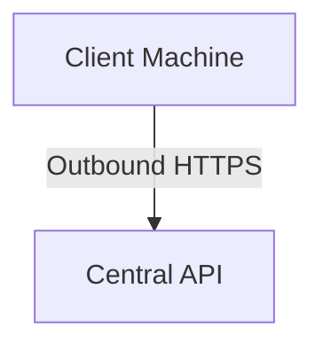

# Agent Design

## Purpose

The agent is a small monitoring client installed on the bussiness client machine and it is responsible for colleting system health data.

The agent is designed for environments where client machines are usually behind routers, NAT, firewalls, or dynamic IP addresses. Because of this, the agent uses an outbound push model instead of requiring the central platform to connect inbound to the client network.

## Main Responsibilities

- Send regular heartbeats
- Collect system health data
- Send results to the backend
- Log locally the data collected

## Agent Communication Model

The agent communicates with the backend using outbound HTTPS requests.

The central platform does not need direct network access to the client machine.

