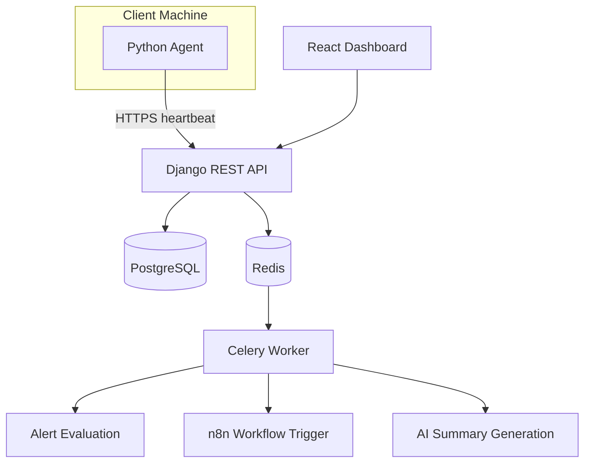

# Architecture Overview

# Table of contents
1. [Purpose](#purpose)
2. [Objetives](#objetives)
3. [Main components](#main-components)
4. [System flow](#system-flow)
5. [MVP functions](#mvp-functions)
6. [Future improvements](#future-improvements)
7. [Architecture diagram](#architecture-diagram)

## Purpose

ClientHealthMonitor is a tool for IT technicians to monitor and log the health of client machines (computers, POS machines, servers, etc). The idea is to be aware of any changes that might put at risk the machine and hinder the bussiness client's work.

The system uses a small agent that is installed on client machines to collect all that data, which is then sent by the agent to the server for the technicians to review.

## Objetives

- Monitor client machines
- Collect basic system health data
- Log all important failures
- Centralize alerts and information
- Integrate with automation tools, to expand how the data is used
- Add client specific information to better provide support

## Main components

- React frontend dashboard
- Django backend REST API
- PostgreSQL database
- Python client agent
- Redis message broker
- Celery background workers
- Celery beat schedular
- n8n automation workflows

## System flow

1. Agent runs on client machine.
2. Agent collects system health data.
3. Agent sends a hearbeat to the server.
4. Backend stores received data.
5. Celery background workers evaluate data and create alerts if needed.
6. Automation workflows will receive the data.
7. The technician checks all alerts and results from the automations on the dashboard.

## MVP functions

- User authentication
- User restriction
- Client management
- Machine management
- Collection and audit of system health metrics
- Alerts
- General dashboard with cards

## Future improvements

- Remote script execution
- Better health metrics collection integration with specific softwares
- Remote control

## Architecture Diagram

